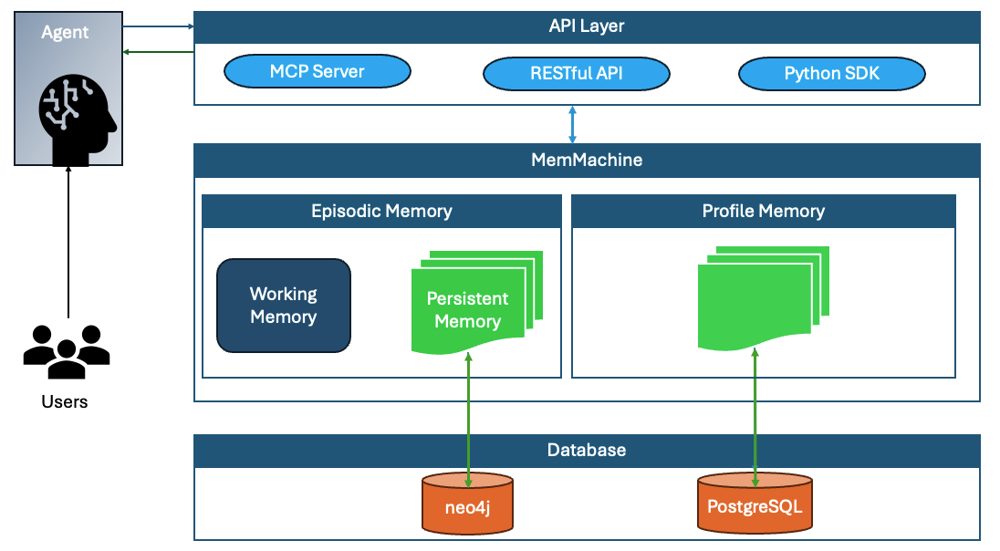

## MemMachine behind the Cover

MemMachine, like any machine, consists of several different components that work together to store memory intelligently, retrieve memory intelligently, and use the right memory combination to assist AI Agents in generating the best output for a given question or query.

In this section we'll dive into an overview of the various components of MemMachine, discuss how each of the larger areas work together, and provide links to more information for each component.

## Overview of components

### Memory Types

MemMachine works as an intelligent memory layer on top of a user's Agentic LLM experience.  It gathers input via Python APIs in a Memory Instance, then determines if that input is profile, short-term and/or long-term:  
 - **Profile memory** consists of information specific to the user and their experience.  It is consumed by the Profile Engine.
 - **Short-term memory** consists of episodic memory and summaries of the episodic memory.  A raw episode consists of 1 message. 
 - **Long-term memory** consists of a batch of episodes that is generated from the short-term memories.  The Episode batch is then ranked using a Reranker and deduplicated for the most frequent hits.  

 For more information about how MemMachine uses memory, please check out our [Memory Types](./memory_types.mdx) page.
