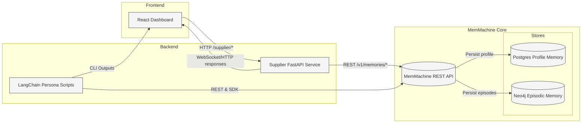

# Amazon Supplier Management System

A supplier management application for Amazon that leverages MemMachine to store and retrieve contextual supplier information.

## Features

- **Supplier Data Ingestion**: Enter supplier information and map it to CRM data
- **Contextual Querying**: Retrieve supplier information with summaries from episodic memory and contextual data from profile memory
- **Memory Integration**: Automatically stores supplier data in both episodic and profile memory

## Architecture

The system consists of:
1. **Supplier Server** (`supplier_server.py`): FastAPI middleware that interfaces with MemMachine backend
2. **Query Constructor** (`query_constructor.py`): Formats queries using episodic and profile memory
3. **Frontend** (`frontend/app.py`): Streamlit UI for entering and querying supplier data

## Setup

### Prerequisites

1. Ensure MemMachine backend is running on `http://localhost:8080`
2. Install dependencies:
   ```bash
   pip install fastapi uvicorn streamlit requests python-dotenv boto3 openai
   ```

### Environment Variables

Create a `.env` file or set the following environment variables:

```bash
export MEMORY_BACKEND_URL=http://localhost:8080
export SUPPLIER_PORT=8001
export SUPPLIER_SERVER_URL=http://localhost:8001
export MODEL_API_KEY=your_api_key_here  # For LLM integration
```

### Running the Application

1. **Start the supplier server:**
   ```bash
   cd examples/amazon_suppliers
   python supplier_server.py
   ```

2. **Start the frontend:**
   ```bash
   cd examples/amazon_suppliers/frontend
   streamlit run app.py
   ```

3. **Access the application:**
   - Frontend: http://localhost:8501
   - Supplier API: http://localhost:8001
   - API Docs: http://localhost:8001/docs

### What you'll see

- **System Status panel** monitors MemMachine and PostgreSQL connectivity so you know when dependencies are healthy before querying suppliers.
- **Quick Prompt suggestions** offer one-click example queries to showcase how episodic and profile memories enrich responses.
- **Memory Timeline** visualizes episodic events returned from MemMachine during each query, making memory updates transparent.

## LangChain Integration Overview

The supplier service now includes LangChain utilities that mirror and extend the behaviour of the `/supplier/chat` endpoint:

- `memmachine_search_tool` wraps the MemMachine `/v1/memories/search` API as a LangChain Tool, allowing agents to orchestrate memory lookups.
- `run_langchain_chat` delegates chat completions to LangChain’s `ChatOpenAI`, giving us richer orchestration, token tracking, and future access to chains/agents.

The new LangChain personas and utilities live in `examples/langchain/` and all write back to the same MemMachine store, so the supplier dashboard’s Memory Timeline reflects both FastAPI and LangChain activity.

### Demo narration cheat-sheet

> “We’re running three services: MemMachine (Docker), the supplier FastAPI backend, and the React dashboard. MemMachine is the shared memory layer; the supplier service writes episodic entries, and the UI visualises them.”

> “We ingest a supplier note—Cascadia Components, November 5th—and query it back. The response includes the raw episode and an LLM prompt, and the React Memory Timeline updates instantly.”

> “LangChain personas (sales, ops, manager) run via CLI, each writing to MemMachine. Their outputs appear in the same timeline and can be pulled via Swagger.”

> “A multi-persona script synthesises a leadership briefing from all three personas, storing the briefing under `profile_leadership` for later review.”

> “Retrieval QA asks ‘What logistics risks exist for SUP-202?’ and uses MemMachine memories as context, listing the exact sources used.”

> “Swagger proves the data exists—`GET /v1/agents/langchain_agent/sessions` lists the persona sessions, and `POST /v1/memories/search` returns the actual dialogue. That’s the centralized memory story.”

## Memory Strategy

### What data do we remember?
- Supplier interactions: ingest comments, queries, incidents, negotiations via `/supplier/ingest` and `/supplier/query`.
- Persona narratives: outputs from `run_profile.py`, `aggregated_briefing.py`, and `retrieval_qa_demo.py` (sales, ops, manager, leadership briefings).
- Metadata: timestamps, session IDs (`profile_*`), producer/consumer identifiers, prompt traces, LLM response stats.

### Storage, retrieval, updates
- **Storage**: FastAPI and LangChain clients call MemMachine REST endpoints (`/v1/memories/episodic`, `/v1/memories/profile`). Episodic memory persists to Neo4j; profile memory to Postgres.
- **Retrieval**: `/supplier/query` calls `/v1/memories/search`; React timeline uses the same endpoint; LangChain retriever (`memmachine_retriever.py`) converts search results into `Document` objects so Retrieval QA can run; Swagger provides raw JSON verification.
- **Updates**: new episodes appended via REST; summary/briefing episodes tagged by persona; future enhancements could add conflict detection or digest episodes.

### Data sources & simulation
- Human workflows: supplier ingest/query through REST (curl, swagger, UI).
- LangChain personas/briefings: `run_profile.py`, `aggregated_briefing.py`, `retrieval_qa_demo.py` for scripted interactions.
- Swagger tests: `POST /v1/memories/search`, `GET /v1/agents/{agent}/sessions` to simulate audits.

### Measuring effectiveness
- Check recall accuracy (does `/supplier/query` or retrieval QA answer match stored notes?).
- Persona personalization (each session returns tailored responses and shows up in session list).
- Latency & token metrics from `run_langchain_chat` logs.
- Potential automated tests: assert persona runs create specific episodes; inspect timeline entries after each run.

### Ethical & privacy considerations
- Supplier notes can include sensitive business data; implement role-based access, anonymization, or redaction as needed.
- Obey retention policies—MemMachine offers APIs to delete or clear sessions when required.
- Maintain audit trails (`/v1/agents/.../sessions`) to track who interacted with what data.

### Running LangChain personas alongside the supplier app

```bash
cd ../../langchain
source ../../.venv/bin/activate
export OPENAI_API_KEY=sk-...  # reuse MODEL_API_KEY

# Sales / Ops / Manager personas
python run_profile.py --profile profile_sales "Summarize outstanding negotiations for supplier SUP-202."
python run_profile.py --profile profile_ops "Flag any logistics risks for supplier SUP-202."
python run_profile.py --profile profile_manager "Create a leadership briefing for supplier SUP-202."

# Multi-persona leadership briefing
python aggregated_briefing.py SUP-202 --history-limit 5

# Retrieval QA grounded in MemMachine
python retrieval_qa_demo.py "What logistics risks exist for supplier SUP-202?" --session-id profile_ops
```

Refresh the supplier UI at `http://localhost:3000` to see the LangChain-generated episodes in the Memory Timeline. Alternatively, use Swagger (`GET /v1/agents/{agent_id}/sessions`, `POST /v1/memories/search`) to showcase the stored sessions in MemMachine.

## Architecture Diagram



## Usage

### Adding Supplier Data

1. Navigate to the "Add Supplier Data" tab
2. Fill in supplier information:
   - **Supplier ID**: Unique identifier (e.g., SUP-001)
   - **Company Name**: Required
   - Contact details, products, capacity, certifications
   - Optional CRM integration data
3. Click "Submit Supplier Data"

The system will:
- Store supplier information in episodic memory (what has been recorded)
- Extract profile information into profile memory (persistent characteristics)

### Querying Suppliers

1. Navigate to the "Query Supplier" tab
2. Enter:
   - **Supplier ID**: The supplier to query
   - **Query**: Natural language question (e.g., "Tell me everything about this supplier")
3. Click "Query Supplier"

The system will:
- Search both episodic and profile memory
- Generate a contextual response combining:
  - Summary from episodic memory (what has been recorded)
  - Contextual information from profile memory (persistent characteristics)

## API Endpoints

### POST `/supplier/ingest`
Ingest supplier information into memory system.

**Request Body:**
```json
{
  "supplier_id": "SUP-001",
  "supplier_data": {
    "company_name": "Acme Corp",
    "contact_name": "John Doe",
    "email": "john@acme.com",
    ...
  },
  "crm_data": {
    "crm_id": "CRM-123",
    "status": "Active",
    ...
  }
}
```

### POST `/supplier/query`
Query supplier information with contextual memory.

**Request Body:**
```json
{
  "supplier_id": "SUP-001",
  "query": "Tell me about this supplier"
}
```

## Memory Types

- **Episodic Memory**: Stores individual supplier data entries and interactions
- **Profile Memory**: Stores persistent supplier characteristics and facts extracted from episodes

## Integration with MemMachine

The application uses MemMachine's REST API:
- `POST /v1/memories`: Store supplier data
- `POST /v1/memories/search`: Search both episodic and profile memory

All data is organized by:
- `group_id`: "amazon_suppliers"
- `agent_id`: ["supplier_manager"]
- `user_id`: ["amazon_admin"]
- `session_id`: "supplier_{supplier_id}"

