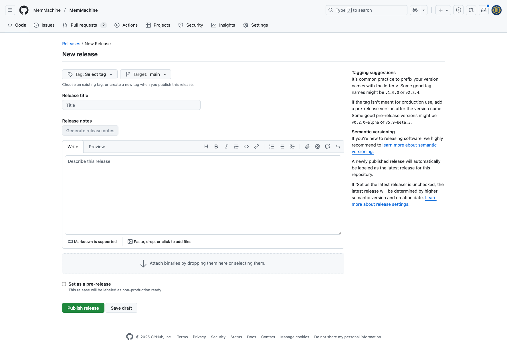

# Creating and Deleting a MemMachine Release in GitHub

## Introduction

This document outlines the steps for creating and, if necessary, deleting a versioned release of the project's source code on GitHub. This process uses the GitHub UI exclusively, which is ideal for repositories with protected branches.

## Step 1: Draft a New Release on GitHub

This is the primary step where you will create the release and its associated Git tag in a single action.

1. **Go to the [MemMachine GitHub repository](https://github.com/MemMachine/MemMachine).**
2. **Click on the "Releases" tab** (itis located on the right side of the repository's main page).
3. **Click on "Create a new release".** You will see a screen similar to this screenshot.
    
4. **Create or choose a tag.** In the "Choose a tag" field, type your new version number (e.g., `v1.0.0`). GitHub will automatically create this new tag when you publish the release.

    **Tagging suggestions**
    It’s common practice to prefix your version names with the letter v. Some good tag names might be v1.0.0 or v2.3.4.

    If the tag isn’t meant for production use, add a pre-release version after the version name. Some good pre-release versions might be v0.2.0-alpha, v5.9-beta.3, or v0.3.0-rc1.

    **Semantic versioning**
    If you’re new to releasing software, we highly recommend to [learn more about semantic versioning](http://semver.org/).

5. **Enter a title.** Give your release a descriptive title (e.g., "Version 1.0.0 - Initial Release").
6. **Write release notes.** To get a list of all changes and contributors, click the **"Generate release notes"** button. GitHub will automatically populate this section with:

    - **What's Changed:** A list of all commits since the last release, categorized by commit message prefixes like `feat:` (new features), `fix:` (bug fixes), and `docs:` (documentation changes).
    - **New Contributors:** A list of any new contributors since the last release.
    - **Full Changelog:** A link to the complete list of changes between the two versions.

    You can then edit and add more details to this generated content as needed.

7. **Choose the release type.** You can check the "This is a pre-release" box if you want to mark it as a beta version; otherwise, leave it unchecked.
8. **Publish the release.** Click the "Publish release" button to finalize and publish your new versioned release.

## Step 2: Verify the Release

After publishing, you can go back to the "Releases" tab to see your new release. It will have a link to the source code as a `.zip` and `.tar.gz` file, and the release notes you wrote will be displayed. This page provides a clean, permanent record of your project's history.

## Deleting a Release

If you create a release with a typo or an incorrect tag, you cannot simply edit the tag name. You must delete both the release and the tag.

1. **Delete the release.**

    - Navigate to the **Releases** page of your repository.
    - Find the release you want to delete and click the three dots (`...`) to the right of the release.
    - Select **Delete**.
    - Confirm the deletion.

2. **Delete the Git tag.**

    - Deleting the release from the UI does **not** delete the associated tag.
    - Navigate to the **Tags** page of your repository. You can find this by going to the main repository page and clicking on the tag number next to the branch dropdown.
    - Find the tag with the incorrect name.
    - Click the delete icon (trash can) next to the tag.
    - Confirm the deletion.

Once both the release and the tag have been deleted, you can create a new release with the correct version number.
